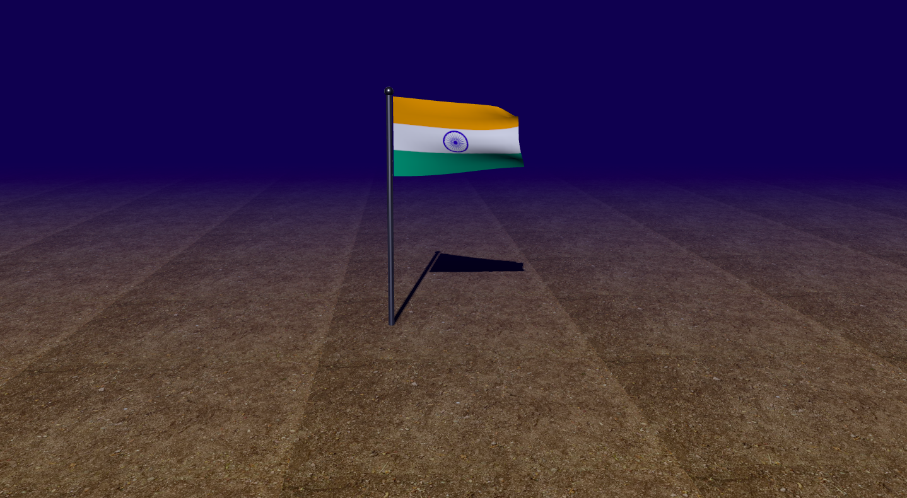

# Indian Flag Simulation using Three.js



## Overview
Indian Flag Simulation is an open-source project built with [Three.js](https://threejs.org/) to simulate the Indian flag waving in a 3D environment. This project celebrates "Azadi ka Amrit Mahotsav" by showcasing the beauty of the tricolor in a realistic physics-based animation.

## Features
- Realistic waving Indian flag simulation.
- WebGL-powered 3D rendering.
- Interactive controls for a better visual experience.

## Libraries and Dependencies
The project uses the following libraries:
- **Three.js**: For creating and rendering 3D graphics.
- **OrbitControls**: To enable interactive mouse controls.
- **WindyCloth.js**: A custom module to simulate cloth physics.

## Installation
To set up and run the project locally, follow these steps:

1. Clone the repository:
   ```bash
   git clone https://github.com/cybertiwari/Indian-Flag.git
   ```

2. Navigate to the project directory:
   ```bash
   cd Indian-Flag
   ```

3. Open the `index.html` file using any local server (e.g., Python HTTP server):
   ```bash
   python -m http.server
   ```
   Alternatively, use tools like [VS Code Live Server](https://marketplace.visualstudio.com/items?itemName=ritwickdey.LiveServer).

4. Open the project in your browser at `http://localhost:8000` (or the port specified by your server).

## Usage
- Open the project in a browser.
- View the Indian flag waving beautifully in 3D.
- Interact with the scene using mouse controls (rotate, zoom, pan).

## Contributing
Contributions are welcome! Submit issues or pull requests to improve this project.

## License
This project is licensed under the [MIT License](https://github.com/cybertiwari/Indian-Flag/blob/master/LICENSE).

## Repository Link
[Indian Flag Simulation GitHub Repository](https://github.com/cybertiwari/Indian-Flag)

